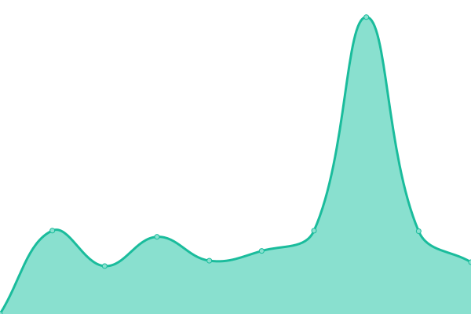

# [📈 Live Status](https://status.makepro-x.com): <!--live status--> **🟧 Partial outage**

This repository contains the open-source uptime monitor and status page for the [MakePro X Cloud Services](makepro-x.com), powered by [Upptime](https://github.com/upptime/upptime).

<!--start: status pages-->
<!-- This summary is generated by Upptime (https://github.com/upptime/upptime) -->
<!-- Do not edit this manually, your changes will be overwritten -->
<!-- prettier-ignore -->
| URL | Status | History | Response Time | Uptime |
| --- | ------ | ------- | ------------- | ------ |
|  [Website](https://my.makepro-x.com) | 🟩 Up | [website.yml](https://github.com/makeproaudio/status/commits/HEAD/history/website.yml) | 

 1143ms
     
 | 

<a href="https://status.makepro-x.com/history/website">100.00%</a>
    

|  [Cloud Service](https://my.makepro-x.com) | 🟩 Up | [cloud-service.yml](https://github.com/makeproaudio/status/commits/HEAD/history/cloud-service.yml) | 

 117ms
     
 | 

<a href="https://status.makepro-x.com/history/cloud-service">100.00%</a>
    

|  Authentication | 🟩 Up | [authentication.yml](https://github.com/makeproaudio/status/commits/HEAD/history/authentication.yml) | 

 569ms
     
 | 

<a href="https://status.makepro-x.com/history/authentication">100.00%</a>
    

|  [Forum](https://forum.makepro-x.com) | 🟩 Up | [forum.yml](https://github.com/makeproaudio/status/commits/HEAD/history/forum.yml) | 

 617ms
     
 | 

<a href="https://status.makepro-x.com/history/forum">100.00%</a>
    

|  [Documentation](https://glue.makepro-x.com) | 🟩 Up | [documentation.yml](https://github.com/makeproaudio/status/commits/HEAD/history/documentation.yml) | 

 191ms
     
 | 

<a href="https://status.makepro-x.com/history/documentation">100.00%</a>
    

|  Software Downloads | 🟩 Up | [software-downloads.yml](https://github.com/makeproaudio/status/commits/HEAD/history/software-downloads.yml) | 

 6420ms
     
 | 

<a href="https://status.makepro-x.com/history/software-downloads">100.00%</a>
    

|  CDN | 🟩 Up | [cdn.yml](https://github.com/makeproaudio/status/commits/HEAD/history/cdn.yml) | 

 853ms
     
 | 

<a href="https://status.makepro-x.com/history/cdn">100.00%</a>
    

|  Crash Reporting | 🟥 Down | [crash-reporting.yml](https://github.com/makeproaudio/status/commits/HEAD/history/crash-reporting.yml) | 

 4401ms
     
 | 

<a href="https://status.makepro-x.com/history/crash-reporting">95.14%</a>
    

|  Monitoring | 🟩 Up | [monitoring.yml](https://github.com/makeproaudio/status/commits/HEAD/history/monitoring.yml) | 

 629ms
     
 | 

<a href="https://status.makepro-x.com/history/monitoring">100.00%</a>
    

<!--end: status pages-->

[**Visit our status website →**](https://status.makepro-x.com)

## 📄 License

- Powered by: [Upptime](https://github.com/upptime/upptime)
- Code: [MIT](./LICENSE) © [MakeProAudio GmbH](https://makepro-x.com)
- Data in the `./history` directory: [Open Database License](https://opendatacommons.org/licenses/odbl/1-0/)
